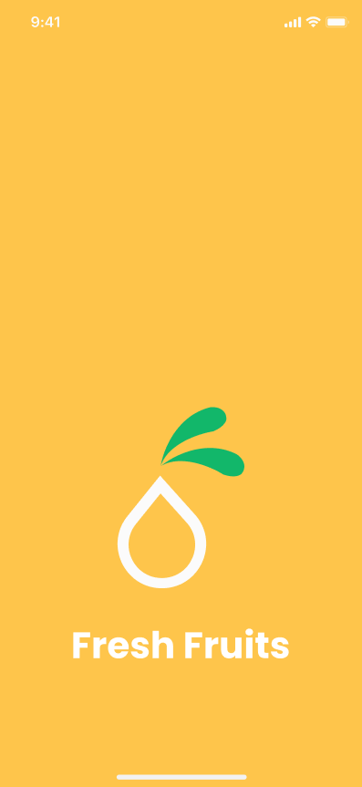
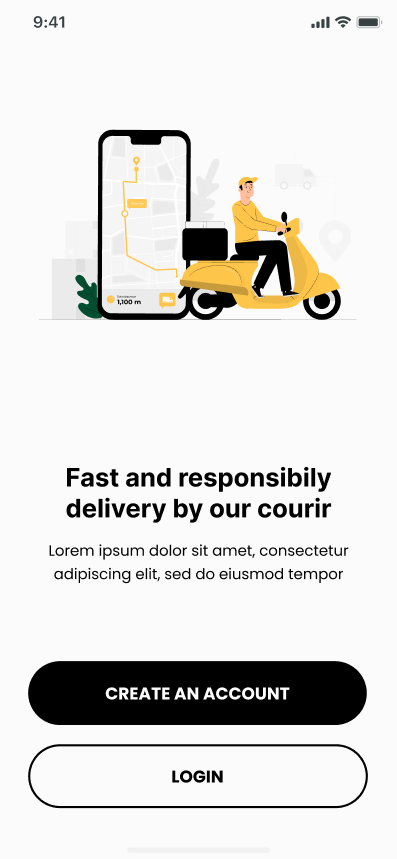
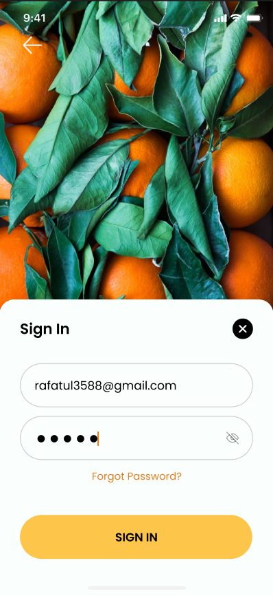
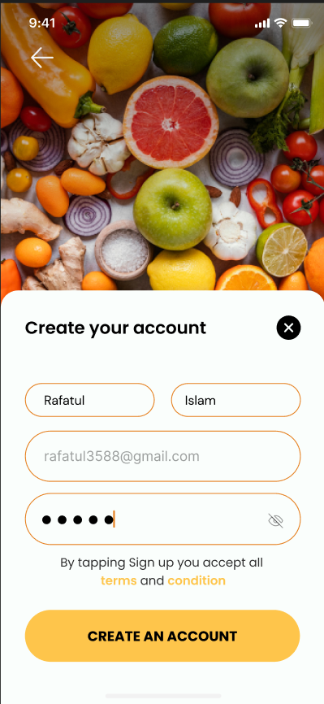
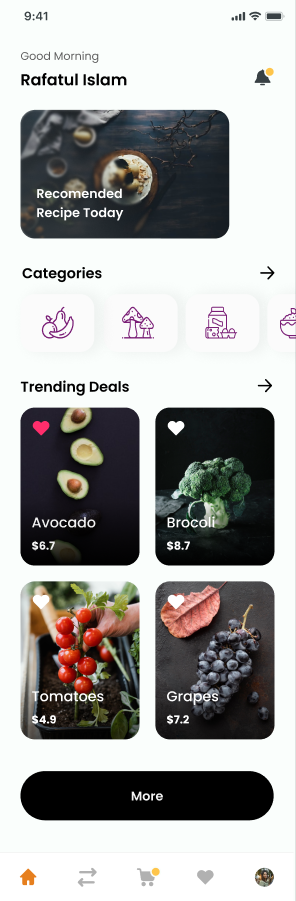
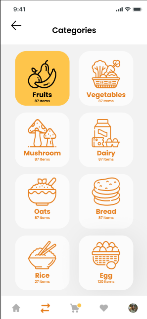

# Fresh Fruits Flutter App

A polished Flutter mobile application for browsing fresh grocery categories, viewing trending products, and managing a local user profile. The app includes onboarding, sign up, login, persistent session handling, a home dashboard, category browsing, and profile update flows.

## Overview

Fresh Fruits is built as a final Flutter project with a clean Material UI, custom image assets, and the Poppins font family. User account data and login state are stored locally using `shared_preferences`, making the app easy to run without a backend service.

## Features

- Splash screen with automatic navigation based on saved login state
- Onboarding screen with account creation and login entry points
- Local sign up and login flow using `SharedPreferences`
- Home screen with personalized greeting, featured banners, categories, and trending products
- Categories screen with a responsive product-category grid
- Profile screen for viewing and updating user information
- Logout and delete-account actions
- Custom image assets and Poppins typography
- Bottom navigation between the main app sections

## Screenshots

| Splash | Onboarding | Sign In |
| --- | --- | --- |
|  |  |  |

| Sign Up | Home | Categories |
| --- | --- | --- |
|  |  |  |

## Tech Stack

- Flutter
- Dart
- Material Design
- `shared_preferences` for local persistence
- `intl` for formatting utilities
- `flutter_lints` for static analysis rules

## Project Structure

```text
lib/
  main.dart                 # App entry point and route registration
  prefsUser.dart            # Local user/session persistence helper
  Screens/
    splashScreen.dart       # Startup routing based on saved user state
    onboarding.dart         # First-time user onboarding
    signUpScreen.dart       # Account creation screen
    loginScreen.dart        # Login screen
    homeScreen.dart         # Main dashboard
    categoriesScreen.dart   # Grocery category grid
    profileScreen.dart      # Profile management screen
  Widgets/
    horezantelCard.dart
    horezantelCategories.dart
    loginField.dart
    profileTextField.dart
    proudctCard.dart
    section.dart
    signUpField.dart

images/                     # App images and product/category assets
screenshots/                # App screenshots used in the README
fonts/                      # Poppins font files
test/                       # Flutter widget tests
```

## Requirements

Before running the project, make sure you have:

- Flutter SDK installed
- Dart SDK included with Flutter
- Android Studio or VS Code with Flutter support
- Android emulator, iOS simulator, or a physical device

The project currently targets Dart SDK `^3.8.1`.

## Getting Started

1. Clone or open the project directory:

   ```bash
   cd final_project_flutter1
   ```

2. Install dependencies:

   ```bash
   flutter pub get
   ```

3. Run the app:

   ```bash
   flutter run
   ```

## Useful Commands

Run static analysis:

```bash
flutter analyze
```

Run tests:

```bash
flutter test
```

Build an Android APK:

```bash
flutter build apk
```

Build an Android App Bundle:

```bash
flutter build appbundle
```

## App Flow

When the app starts, the splash screen checks the saved user state:

- Logged-in users are sent to the home screen.
- Users with an existing saved account are sent to the login screen.
- New users are sent to the onboarding screen.

After signing up, users can log in, browse products and categories, update their profile details, log out, or delete their saved account.

## Assets and Fonts

The app uses local assets declared in `pubspec.yaml`:

- `images/` for onboarding, authentication, category, product, logo, and avatar images
- `fonts/Poppins-Regular.ttf`
- `fonts/Poppins-Bold.ttf`

If new assets are added, update `pubspec.yaml` and run:

```bash
flutter pub get
```

## Notes

- This project uses local storage only and does not connect to a remote backend.
- Passwords are stored locally for demonstration purposes. For production apps, use secure authentication and encrypted storage.
- Some UI labels and file names contain spelling inconsistencies inherited from the current codebase, but they do not prevent the app from running.

## Author

Mahmoud Nasser Abu Kraiem

## License

This project is intended for educational and portfolio use. Add a license file before publishing or distributing it publicly.
